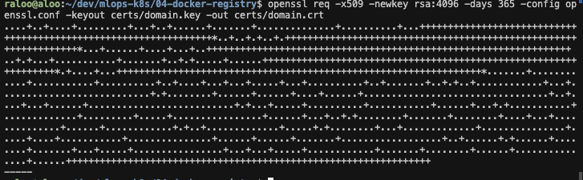
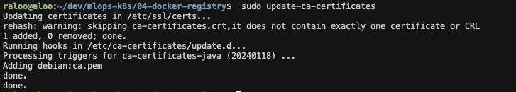
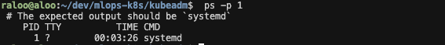
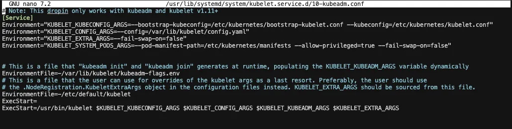
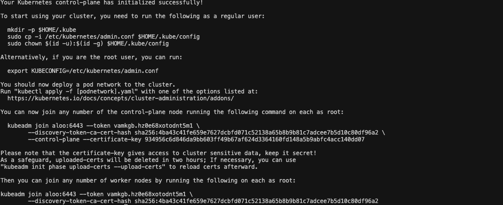
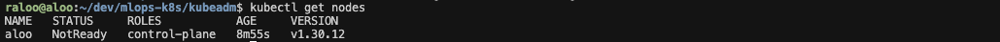
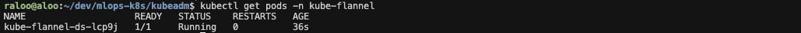
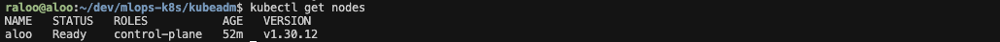
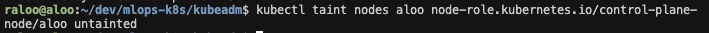

# mlops-k8s-offline
# Offline Kubernetes for MLOPS

In normal situation deployments of AI models including LLMs are done in dockerized enviroments. However, with the need to scale and manage these resources we use kubernetes. Kubernetes in a container orchestration tool. 
I have recently been working on OSS LLMs, custom trained LLMs and deployment of these LLMs and other AI models on premise due to the private nature of data. The deployments have been made at scale on use by multiple concurrent users and to enable GPU compute efficiency.  
To be able to achieve this, i have deployed kubernetes (k8s) clusters totally offline. The servers( which are DGX stations H100 and H200) are not connected to the internet and are accessible on local offline environment. 

I am aware that there are several materials setting up k8s cluster. But this series will focus on the offline setup of the cluster and running LLMs. 

## Requirements

This series is based of deployment on

- ubuntu 22.04
- k8s 1.30.6
- cuda drivers
- Assumption that there is nothing installed in the server.

# Part1: Resources

## Step1: Download and Install docker

Docker is a platform for shipping and running containerized applications.

1. Navigate to the official [install docker on ubuntu](https://docs.docker.com/engine/install/ubuntu/) on a machine with internet.
2. Navigate to set up docker with apt and run the first instruction to add official gpg key and repo to apt resources. 
3. Download the docker packages instead of install.
    
    ```bash
    # Make a directory to save the packages
    mkdir docker-packages
    cd docker-packages
    
    # Download the respective packages
    apt download docker-ce
    apt download docker-ce-cli
    apt download docker-buildx-plugin
    apt download docker-compose-plugin
    apt download contanerd
    ```
    
4. Copy the downloaded `*.deb` files to the offline server and install them in the following order. 
    
    ```
    sudo apt install ./docker-ce_5_3a27.3.1-1~ubuntu.22.04~jammy_amd64.deb
    sudo apt install ./docker-ce-cli_5_3a27.3.1-1~ubuntu.22.04~jammy_amd64.deb
    sudo apt install ./docker-buildx-plugin_0.17.1-1~ubuntu.22.04~jammy_amd64.deb
    sudo apt install ./docker-compose-plugin_2.29.7-1~ubuntu.22.04~jammy_amd64.deb
    ```
    

## Step2: Download and Install containerd

Containerd is an container runtime that will be used in running containers in the k8s cluster. 

1. Copy the containerd package dowloaded in step1. 
2. Install containerd
    
    ```bash
     sudo apt install ./containerd.io_1.7.24-1_amd64.deb
    
    ```
    
3. Check the `/etc/containerd` and create file `/etc/containerd/config.toml`. We are creating this file manually since we will make changes later to some variable to enable cluster init and working with local registry.
4. Run the default configs for containerd and copy the output to`/etc/containerd/config.toml`
    
    ```bash
     containerd config default
    ```
    
    (Optional): Alternatively you can achieve this by running 
    
    ```bash
    sudo containerd config default > sudo /etc/containerd/config.toml
    ```
    
5. Restart containerd 
    
    ```bash
     sudo systemctl restart containerd
    ```
    

## Step3: Install container toolkit

Contains a set of tools that allow for GPu support in containerized environment for instance docker and k8s.

1. Navigate to the official [NVIDIA Container Toolkit](https://docs.nvidia.com/datacenter/cloud-native/container-toolkit/latest/install-guide.html) website [](https://docs.docker.com/engine/install/ubuntu/)on a machine with internet.
2. Navigate to set installation with apt on ubuntu/debian and run the first instruction to configure the production repo, and `apt` update. 
3. Download the NVIDIA Container Toolkit packages instead of install.
4. The container toolkit has dependency packages `libnvidia-container` , `libnvidia-container-tools` and `nvidia-container-toolkit-base`
    
    ```bash
    sudo apt download ./libnvidia-container1_1.17.2-1_amd64.deb
    sudo apt download ./libnvidia-container-tools_1.17.2-1_amd64.deb  reame.md
    sudo apt download ./nvidia-container-toolkit-base_1.17.2-1_amd64.deb
    sudo apt download ./nvidia-container-toolkit_1.17.2-1_amd64.deb
    ```
    
    Install the downloaded packages on the offline server in the order of appearance below. 
    
    ```bash
    sudo apt install ./libnvidia-container1_1.17.2-1_amd64.deb
    sudo apt install ./libnvidia-container-tools_1.17.2-1_amd64.deb  reame.md
    sudo apt install ./nvidia-container-toolkit-base_1.17.2-1_amd64.deb
    sudo apt install ./nvidia-container-toolkit_1.17.2-1_amd64.deb
    ```
    

## Step4: Install local docker registry

Since the deployment is on an offline environment there is need to set up a local registry that is accessible to all the nodes in the cluster. The registry will be used to upload the docker images for the kubeadm services, gpu operator and other services that will be latter ran on the cluster. 

### 4.1 Generate the ssl certificates

First we need to generate ssl certificates that will be used to authenticate the registry to the node on the cluster. If you already have predefined certificates then it is okay to skip the creation of the certificates. 

1. Create the certificates directory.
    
    ```bash
     mkdir certs
    ```
    
2. Create and Copy below content to **openssl.conf**
    
    *Update **Docker Server IP** with the IP address of your server where you will be running docker registry.* 
    
    ```bash
    [ req ]
            distinguished_name = req_distinguished_name
            x509_extensions     = req_ext
            default_md         = sha256
            prompt             = no
            encrypt_key        = no
            
            [ req_distinguished_name ]
            countryName            = "AA"
            localityName           = "metaverse"
            organizationName       = "future"
            organizationalUnitName = "futurelife"
            commonName             = "255.254.253.252"
            emailAddress           = "example@future.com"
            
            [ req_ext ]
            subjectAltName = @alt_names
            
            [alt_names]
            IP.1 = 255.254.253.252 #change the IP here
    ```
    
3. Generate the certificate and private key. Expires in 1 year(you can change accordingly).
    
    ```bash
    openssl req -x509 -newkey rsa:4096 -days 365 -config openssl.conf -keyout certs/domain.key -out certs/domain.crt
    ```
    
    
    
4. Verify the created certificates. A successful output will include the signature of the algorithm, the issuer, validity, rsa encryption etc. 
    
    ```bash
     openssl x509 -text -noout -in certs/domain.crt
    ```
    
5. Update the insecure certificates
    
    After adding the certificates that now live in the local server, update the docker daemon configuration to allow the usage of the private docker registry.
    
    a. Navigate to `/etc/docker/daemon.json`  update the following configuration on the local server with the registry. The port number `6000` represents the port number that is later on used in the 
    
    ```bash
     {
       "insecure-registries": ["255.254.253.252:6000"]
     }
    ```
    
    b. Restart the docker daemon to apply the changes. 
    
    ```bash
     sudo systemctl restart docker
    ```
    

### 4.2: Deploy docker registry with the TLS certificates (Recommended)

Even though the above configurations may allow starting of the docker registry and  using it, The accessibility is only limited to the deployed local server. We therefore need to add the certificates toe the docker registry image to allow authentication for usage in the other nodes on the cluster.
We use the following docker compose file to set up the TLS/SSL certs. By default the docker registry image `registry:2` run on port 5000 and we map it to the host on port 6000. 

1. Save the registry image. 

From the online server pull the registry transfer it to the offline server and load the the image. 

```bash
# On online server
## 1. Pull the registry 
docker pull  registry:2

## 2. save the image to a local tar file
docker save registry:2 -o registry-2.tar

## 3. copy and transfer the tar file to the offline server

## 4. Load the registry image 
sudo docker load -i  registry-2.tar
```

1. Set up the docker compose with TLS. The volume retains the images of uploaded to the registry even after updates.
    
    ```yaml
    services:     
      registry:
        container_name: docker-registry
        restart: always
        image: registry:2
        environment:
          REGISTRY_HTTP_TLS_CERTIFICATE: certs/domain.crt
          REGISTRY_HTTP_TLS_KEY: certs/domain.key
        ports:
          - 6000:5000
        volumes:
          - docker-registry-data:/var/lib/registry
          - ./certs:/certs
    
    volumes:
      docker-registry-data: {} 
    ```
    
2. Run thee docker compose
    
    ```bash
         docker compose up -d
    ```
    
    **NOTE**: To check the registry is running on the deployed IP
    
    ```
     curl -v https://<ip address>:<port>/v2/
    ```
    
3. (optional) Alternatively you can test that the registry is working by pushing a docker image to the locally hosted registry. Let use the image we dowloaded previously 
    1. Tag the image with the registry IP and port 
        
        ```bash
        docker tag registry:2 <ip address>:6000/registry:2
        ```
        
    2. Push the tagged image to the registry
        
        ```bash
        docker push <ip address>:6000/registry:2
        ```
        
        
        
    3. Troubleshoot:  `tls: failed to verify certificate: x509: certificate signed by unknown authority`
        
        In case you encounter the above error this indicates that the registry IP has not been set in the the `/etc/docker/daemon.json`  Please complete step 4 in section 4.2 and restart the docker daemon.  
        

### Update the CA certificates for use by containerd on k8s cluster

After completing the above steps the docker image can be pushed and pulled by the local registry. However, the images cannot be pulled by the container runtime containerd during the startup of ac container in the cluster.
The  following error occurs on the untrusted certificates from the SSL to be able to add them to be used by the containerd runtime in the cluster proceed as follows.

1. Add the registry's CA certificate to the node's trust store: Copy the CA certificate that signed your registry's certificate to each Kubernetes node and add it to the system's certificate store:
    
    ```
    sudo cp domain.crt /usr/local/share/ca-certificates/ca.crt
    sudo update-ca-certificates
    ```
    
    
    
2. Configure containerd to trust the registry. Edit the containerd configuration file. Replace  `ca_file` with the actual path to your CA certificate.
    
    a. Open the containerd configuration file.
    
    ```
        sudo nano /etc/containerd/config.toml
    ```
    
    b. Update the file paths to the generated certificates and their
    
    ```bash
      [plugins."io.containerd.grpc.v1.cri".registry.mirrors."<ip address>:<port>"]
        endpoint = ["https://<ip address>:<port>"]
      [plugins."io.containerd.grpc.v1.cri".registry.configs."<ip address>:<port>".tls]
        ca_file = "/certs/domain.crt"
    ```
    
3. Restart containerd 
    
    ```
     sudo systemctl restart containerd
    ```
    

# Part2: Install Kubernetes

The installation of kubernetes on the cluster is done using kubeadm. The version used at this point was version `1.30.6` .

## Step1: Download and Push k8 images to local registry

After confirming the local registry is up. Load all the 7 images of kube component.

1. Download the images on an online server, save tag, , copy and load the images on an offline server. Ensure that the downloaded `etcd` and `coredns` images are compatible with the 
    
    ```bash
     docker pull registry.k8s.io/kube-apiserver:v1.30.6  
     docker pull registry.k8s.io/kube-controller-manager:v1.30.6 
     docker pull registry.k8s.io/kube-scheduler:v1.30.6 
     docker pull registry.k8s.io/kube-proxy:v1.30.6 
     docker pull registry.k8s.io/etcd:3.5.15-0
     docker pull registry.k8s.io/pause:3.9
     docker pull registry.k8s.io/coredns/coredns:v1.11.3
    ```
    
2. Export the file server ip
    
    ```bash
    export IP_ADDRESS=<ip-address>:6000 # change ip
    ```
    
3. Tag the  images with the relevant ip address.
    
    ```bash
    docker tag registry.k8s.io/kube-apiserver:v1.30.6  $IP_ADDRESS/kube-apiserver:v1.30.6
    docker tag registry.k8s.io/kube-controller-manager:v1.30.6 $IP_ADDRESS/kube-controller-manager:v1.30.6
    docker tag registry.k8s.io/kube-scheduler:v1.30.6 $IP_ADDRESS/kube-scheduler:v1.30.6
    docker tag registry.k8s.io/kube-proxy:v1.30.6 $IP_ADDRESS/kube-proxy:v1.30.6
    docker tag registry.k8s.io/etcd:3.5.15-0 $IP_ADDRESS/etcd:3.5.15-0
    docker tag registry.k8s.io/pause:3.9 $IP_ADDRESS/pause:3.9
    docker tag registry.k8s.io/coredns/coredns:v1.11.3 $IP_ADDRESS/coredns:v1.11.3
    ```
    
4. Check that all the images are loaded locally
    
    ```bash
     docker image list
    ```
    
5. Push to the local registry
    
    ```bash
     docker push $IP_ADDRESS/kube-apiserver:v1.30.6
     docker push $IP_ADDRESS/kube-controller-manager:v1.30.6
     docker push $IP_ADDRESS/kube-scheduler:v1.30.6
     docker push $IP_ADDRESS/kube-proxy:v1.30.6
     docker push $IP_ADDRESS/etcd:3.5.15-0
     docker push $IP_ADDRESS/pause:3.9
     docker push $IP_ADDRESS/coredns:v1.11.3
    ```
    

## Step2: Configure the pause image

The pause image is used by the kubelet to set up the minimal infrastructure for a pod. In order to initialize the kubeadm this image is needed. For the offline environment we can change the containerd configuration to pull from the local docker registry.

- Add the registry to the containerd config. (You may have already changed it while running containerd)
- Add the pause image on the local docker registry to the containerd configuration.
    - Edit containerd config.
        
        ```bash
        sudo nano /etc/containerd/config.toml
        ```
        
    - Change to the relevant IP
    
    ```bash
    [plugins."io.containerd.grpc.v1.cri".containerd.runtimes.runc]
    [plugins."io.containerd.grpc.v1.cri".containerd.runtimes.runc.options]
    SystemdCgroup = true
    
    [plugins."io.containerd.grpc.v1.cri"]
    sandbox_image = "<ip-address>:6000/pause:3.9" #change this on the toml
    ```
    
- Restart containerd
    
    ```
     systemctl restart containerd
    ```
    

## Step3: Install kubeadm

The kubeadm is effectively the tool that installs the kubernetes. This is installation for `version v1.30.6`. 

1. Download the the kubeadm, kubectl and kubelet. kubeadm  has dependencies which must be in downloaded and installed before installing kubeadm. 
    
    ```bash
    # download k8s network interface
    apt dowload kubernetes-cni
    
    # dowload cri-tool tha enables interaction with container runtime interface
    curl -LO https://github.com/kubernetes-sigs/cri-tools/releases/download/v1.31.1/crictl-v1.31.1-linux-amd64.tar.gz
    
    apt download cri-tools
    apt download ethtool
    apt download conntrack
    ```
    
2. Install kubeadm and the dependencies
    
    ```bash
    apt install ./kubernetes-cni_1.4.0-1.1_amd64.deb
    
    tar -zxvf crictl-v1.31.1-linux-amd64.tar.gz
    sudo mv crictl /usr/local/bin/
    
    sudo apt install ./cri-tools_1.30.1-1.1_amd64.deb
    sudo apt install ./ethtool_1_3a5.16-1ubuntu0.1_amd64.deb
    sudo apt install ./conntrack_1_3a1.4.6-2build2_amd64.deb
    
    # Check the verions
    crictl --version
    ethtool --version
    conntrack --version
    
    ### error *DONT USE
           #sudo dpkg -i ethtool_*.deb conntrack_*.deb
    
    # Install kubeadm
    apt install ./kubeadm_1.30.6-1.1_amd64.deb
    ```
    
3. Install kubectl
    
    ```bash
    apt install ./kubectl_1.30.6-1.1_amd64.deb
    ```
    
4. Install kubelet
    
    ```bash
    apt install ./kubelet_1.30.6-1.1_amd64.deb
    ```
    
5. Check the version of kubeadm
    
    ```
     kubeadm version
     kubectl version
     kubelet version
    ```
    

(Not needed) For installation on an online server run

```bash
#add k8s signing key
curl -fsSL https://pkgs.k8s.io/core:/stable:/v1.30/deb/Release.key | sudo gpg --dearmor -o /etc/apt/keyrings/kubernetes-apt-keyring.gpg
#add software repos
echo 'deb [signed-by=/etc/apt/keyrings/kubernetes-apt-keyring.gpg] https://pkgs.k8s.io/core:/stable:/v1.30/deb/ /' | sudo tee /etc/apt/sources.list.d/kubernetes.list
#update packages 
sudo apt update
# Install kubernetes tools 
sudo apt install kubelet kubectl kubeadm
```

## Step4: Check ports and disable swap

1. Check that the required ports are open inorder for the k8 components to communicate.
    
    ```
     >> nc 127.0.0.1 6443 -v
     # The excpected output is a succeded
     << connection to 127.0.0.1 6443 port [tcp/*] succeeded!
    ```
    
    If you receive a `nc: connect to 127.0.0.1 port 6443 (tcp) failed: Connection refused` make sure that the kubernetes components are well installed. Since kubernetes API sever normally listens on port 6443.
    
2. The default behavior of a kubelet is to fail to start if swap memory is detected on a node. This means that swap should either be disabled or tolerated by kubelet. Disable all the swaps
    
    ```
     sudo swapoff -a
    
    ```
    
    Then use the [sed command](https://phoenixnap.com/kb/linux-sed) below to make the necessary adjustments to the */etc/fstab* file that coments out the swap file (makes swap disabled on reboot):
    
    ```
     sudo sed -i '/ swap / s/^\\(.*\\)$/#\\1/g' /etc/fstab
    ```
    

## Step5: Load containerd modules

1. Load the required **containerd** modules. Start by opening the containerd configuration file in
    
    ```
    sudo nano /etc/modules-load.d/containerd.conf
    ```
    
    Add the following two lines to the file:
    
    ```
    overlay
    br_netfilter
    ```
    
    Save (Press ctl+o then ctrl+x) the file and exit.
    
2. Next, use modprobe to add the modules into the linux kernel:
    
    ```
     sudo modprobe overlay
     sudo modprobe br_netfilter
    ```
    
    The `br_netfilter` module is essential for maintaining network consistency and reliability in Kubernetes environments, particularly for pod-to-pod communication and network policy enforcement.
    
    The `overlay` module is used to implement overlay filesystems, which are commonly used by container runtimes like Docker.
    

## Step6: Configure Kubernetes networking

1. Open the **kubernetes.conf** file to configure Kubernetes networking:
    
    ```
     sudo nano /etc/sysctl.d/kubernetes.conf
    ```
    
    Add the following lines to the file:
    
    ```
     net.bridge.bridge-nf-call-ip6tables = 1
     net.bridge.bridge-nf-call-iptables = 1
     net.ipv4.ip_forward = 1
    ```
    
    Save the file and exit.
    
2. Reload the configuration by typing:
    
    ```
     sudo sysctl --system
    ```
    

## Step7: Set up the hostname (Optional)

Setup the unique name for each of the clusters. If the clusters have their names then there is no need to reset the names.

1. Decide which server will be the master node. Then, enter the command on that node to name it accordingly:
    
    ```bash
     sudo hostnamectl set-hostname controlplane
    ```
    
2. Next, set the hostname on the first worker node by entering the following command:
    
    ```bash
     sudo hostnamectl set-hostname node01
    ```
    
    For the additional  worker nodes, use this process to set a unique hostname on each.
    
    ```bash
     sudo hostnamectl set-hostname node02
     sudo hostnamectl set-hostname node03
    ```
    
3. Edit the hosts file on each node by adding the IP addresses and hostnames of the servers that will be part of the cluster.
    
    ```bash
     nano /etc/hosts
    ```
    
    Add in the following way. Use the actual IPs by running
    
    ```bash
     #<ip-address-of-dgx> allocated name
    255.254.253.252      controlplane   
    255.254.253.251      node01         
    255.254.253.250      node02        
    255.254.253.249      node03        
    255.254.253.248      node04         
    ```
    
4. Restart the terminal application to apply the hostname change.

**NOTE: Make sure that all instructions until here a run on every machine that will be part of the cluster.**

## Step8: Setup the cgroup

Once you finish setting up hostnames on all the cluster nodes, switch to the master node and follow the steps to initialize Kubernetes:

1. Confirm the type of `init system` used by the offline server that will serve as the control plane. We except a `systemd` output. If the architecture is not systemd refer to the official docs to check on the usages of other 
    
    ```bash
     ps -p 1
     # The expected output should be `systemd`
    ```
    
    
    
2. Both the container runtime and the kubelet have a property called "cgroup driver", which is important for the management of cgroups on Linux machines. Open the **kubelet** file in a text editor.
    
    ```bash
     nano /etc/default/kubelet
    ```
    
    Add the following lines to the files.
    
    ```
     KUBELET_EXTRA_ARGS="--cgroup-driver=cgroupfs"
    ```
    
    Save and exit.
    
3. Reload the configuration and restart the kubelet:
    
    ```
    sudo systemctl daemon-reload && sudo systemctl restart kubelet
    ```
    

## Step9: Update the kubeadm configuration file

1. Open the **kubeadm** configuration file:
    
    ```
     sudo nano /usr/lib/systemd/system/kubelet.service.d/10-kubeadm.conf
    
    ```
    
    **error** If the above path does not exist use
    
    ```
      sudo nano /etc/systemd/system/kubelet.service.d/10-kubeadm.conf
    
    ```
    
    Add the following line to the file:
    
    ```
     Environment="KUBELET_EXTRA_ARGS=--fail-swap-on=false"
     Environment="KUBELET_SYSTEM_PODS_ARGS=--pod-manifest-path=/etc/kubernetes/manifests --allow-privileged=true --fail-swap-on=false"
    ```
    
    Save the file and exit.
    
    
    
2. Reload the configuration and restart the kubelet:
    
    ```
     sudo systemctl daemon-reload && sudo systemctl restart kubelet
    ```
    

## Step10: Initialize Kubernetes on Master Node

Finally, initialize the cluster by typing:

**NOTE: Run only on the master node (controlplane)**

- Make sure that the control-plane-endpoint name `--control-plane-endpoint=controlplane` matches the name of the server on the `/etc/hosts` file.

```
sudo kubeadm init --control-plane-endpoint=controlplane --pod-network-cidr="10.244.0.0/16" --apiserver-advertise-address="<ip-address>" --upload-certs
```

You should see a similar output



If the output has error refer to troubleshoot2 to check the possible solutions. 

## Step11: Create kube config directory

K8s configurations need to be stored in directory on the master node. This contatiains the cluster information including the tokens and the certificates. 

1. Create a directory for the Kubernetes cluster:
    
    ```bash
     mkdir -p $HOME/.kube
    ```
    
2. Copy the configuration file to the directory:
    
    ```bash
     sudo cp -i /etc/kubernetes/admin.conf $HOME/.kube/config
    ```
    
3. Change the ownership of the directory to the current user and group using the chown command.
    
    ```bash
     sudo chown $(id -u):$(id -g) $HOME/.kube/config
    ```
    
4. Check that the nodes are initialized successfully. The nodes will indicate not ready since we have not yet set up a network.
    
    
    

### (optional) Join worker nodes and redundant master node

For the other worker nodes, join the initialized controlplane node by typing the instructions for hoining found on the output.

```bash
sudo kubeadm join controlplane:6443 --token <token-output> --discovery-token-ca-cert-hash <hash-output>
```

Similarly, if  a second control plane is to be used which is recommended. You can join it to the master node. This should be run in only the master nodes that are joining the initialized master node. An odd number of master nodes is recommended. 

```bash
sudo kubeadm join controlplane:6443 --token <token-output> --discovery-token-ca-cert-hash <hash-output> --control-plane --certificate-key <cert-key>
```

## Step12: Deploy container network Interface

We now need to deploy the network interface used for the communication in the cluster. After running the initialization command the addons for the networks will show and navigate to the network.

```bash
You should now deploy a pod network to the cluster.
Run "kubectl apply -f [podnetwork].yaml" with one of the options listed at:
  https://kubernetes.io/docs/concepts/cluster-administration/addons/
```

A pod network is a way to allow communication between different nodes in the cluster. We use WeaveNet for the deployment of the network. It tried both the flannel and weavenet installation but settled on flannel due to an unresolved error in dns resolution I experience with core-dns when using weave net. They both have different advantages in the encryption, ease of setup and  performance. 

### Installation with flannel

1. On an online server download flannel. I prefer the manifest to allow you for simpler editing if you are not farmiliar with helm.
    
    ```bash
    # download kube-flannel.yml
    wget -P k8s/k8s-flannel https://github.com/flannel-io/flannel/releases/latest/download/kube-flannel.yml
    ```
    
2. Pull and save the flannel images
    
    ```bash
    # export images that flannel depends on
    cat kube-flannel.yml | grep image
          image: docker.io/flannel/flannel-cni-plugin:v1.2.0
          image: docker.io/flannel/flannel:v0.22.2
          image: docker.io/flannel/flannel:v0.22.2
    
    docker pull --platform=linux/amd64 docker.io/flannel/flannel:v0.22.2
    docker save docker.io/flannel/flannel:v0.22.2 > k8s/k8s-flannel/flannel.tar
    
    docker pull --platform=linux/amd64 docker.io/flannel/flannel-cni-plugin:v1.2.0
    docker save docker.io/flannel/flannel-cni-plugin:v1.2.0 > k8s/k8s-flannel/flannel-cni-plugin.tar
    ```
    
3. On the offline environment copy the save images. Tag the images to the local docker registry and push to the registry.
    
    ```bash
    docker load -i k8s/k8s-flannel/flannel.tar
    docker load -i 8s/k8s-flannel/flannel-cni-plugin.tar
    ```
    
4. On the downloaded flannel yaml file open the yaml and update the images to be those in the local registry. 
    
    ```bash
    - image: docker.io/flannel/flannel:v0.26.3
    + image: <ip-address>:6000/flannel:v0.26.3 
       
    
    - image: docker.io/flannel/flannel-cni-plugin:v1.6.0-flannel1
    + image: <ip-address>:6000/flannel-cni-plugin:v1.6.0-flannel1 
    ```
    
5. Save the run the flannel 
    
    ```bash
    kubectl apply -f kubeflannel.yml
    ```
    
6. The output should be as as follows.
    - The flannel names space should indicate the running nodes
        
        ```bash
        kubectl get pods -n kube-flannel
        ```
        
        
        
    - Additionally, all the pods in the `kube-system` namespace should be running.
        
        ```bash
        kubectl get pods -n kube-flannel
        ```
        
        
        
    - And finally the status of the node will change from `NotReady` to `Ready`
        
        ```bash
        kubectl get nodes
        ```
        
        
        

### (optional) Installation with weave net

In a similar manner pull save and copy the weave net images.

1. Load the images
    
    ```
     sudo docker load -i weaveworks-weave-kube.tar
     sudo docker load -i weaveworks-weave-npc.tar
    ```
    
2. Check successful load and Send them to the local registry
    
    List the images `docker image list` to see below
    
    weaveworks/weave-npc                       latest      690c3345cc9c   3 years ago     39.3MB
    weaveworks/weave-kube                      latest      62fea85d6052   3 years ago     89MB
    
3. Export IP address
    
    ```
     export IP_ADDRESS=10.100.9.36
    
    ```
    
4. Edit the image of the
    
    ```
     image: 'weaveworks/weave-kube:latest' # edit to local registry
     image: 'weaveworks/weave-kube:latest' # Change to local registry
    
    ```
    
    sudo docker tag weaveworks/weave-npc  $IP_ADDRESS/weave-npc
    sudo docker tag weaveworks/weave-kube $IP_ADDRESS/weave-kube
    
5. push the netwrk images to the registry
    
    sudo docker push $IP_ADDRESS/weave-npc
    sudo docker push $IP_ADDRESS/weave-kube
    
6. Run the yaml on a running cluster of control plane
    
    ```
     sudo kubectl apply weave-daemonset-k8s.yaml
    
    ```
    

## Step13: (optional) Untaint nodes

In a case where you would like the master node to also run containers like a worker node , We need to remove the node taint so that is allows for scheduling of pods.

```
kubectl taint nodes aloo node-role.kubernetes.io/control-plane-
```



## Troubleshooting 
